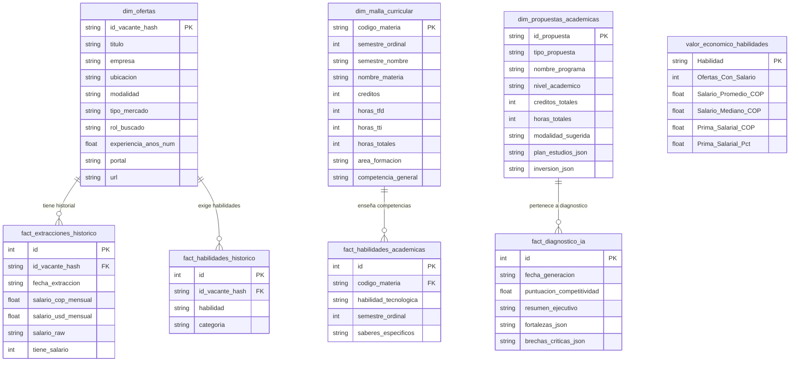

# 🏛️ Arquitectura del Sistema y Especificación Técnica Modular
## Observatorio de Inteligencia Laboral y Diseño Curricular con Inteligencia Artificial
### Fundación Universitaria Cafam (UniCafam) — Escuela de Ingeniería y Ciencias Empresariales

---

## 1. Resumen Ejecutivo y Marco Institucional

El **Observatorio de Inteligencia Laboral y Diseño Curricular de UniCafam** es un ecosistema tecnológico integral diseñado para resolver la brecha estructural de pertinencia entre la oferta de educación superior y las demandas dinámicas del mercado de Analítica, Ingeniería y Ciencia de Datos en Colombia y América Latina.

```
+----------------------------------------------------------------------------------------------------+
|                                    OBSERVATORIO UNICAFAM                                           |
|  [Vigilancia de Mercado]  --->  [Minería NLP & Econometría]  --->  [Diseño Curricular con IA MEN] |
+----------------------------------------------------------------------------------------------------+
```

### 1.1 Planteamiento del Problema
Tradicionalmente, la actualización de planes de estudio universitarios responde a procesos decanales manuales con ciclos de revisión de 3 a 5 años. En disciplinas tecnológicas de alta volatilidad (donde surgen herramientas como Arquitecturas RAG, MLOps, clústeres cloud distribuidos y Lakehouses en períodos de meses), este desfase genera:
1. **Pérdida de competitividad del egresado:** Dificultad para acceder a vacantes de rango salarial senior o internacional.
2. **Asimetría informativa:** Desconocimiento por parte de las directivas universitarias del retorno económico exacto (prima salarial) asociado a cada competencia enseñada.
3. **Desalineación regulatoria:** Complejidad en sustentar las justificaciones de necesidad y pertinencia exigidas por el Ministerio de Educación Nacional (MEN).

### 1.2 Marco Normativo: Decreto 1330 de 2019 (MEN)
El sistema automatiza el cumplimiento riguroso de las condiciones de calidad del **Decreto 1330 de 2019**, específicamente:
* **Condición 1: Justificación del Programa:** Demostración cuantitativa y documentada de la pertinencia del programa frente a las necesidades del entorno productivo regional e internacional.
* **Condición 2: Resultados de Aprendizaje Esperados (RAE):** Definición explícita de lo que el estudiante sabrá y será capaz de demostrar al finalizar su formación, formulados con verbos de acción según la Taxonomía de Bloom.
* **Condición 3: Organización de las Actividades Académicas:** Cumplimiento de la proporción legal de créditos académicos (1 crédito = 48 horas de trabajo total, descompuesto en 16 horas de Acompañamiento Docente [TFD, 1/3] y 32 horas de Trabajo Autónomo e Independiente [TTI, 2/3]).
* **Matriz Integrada de Gestión (MIG):** Formato institucional oficial de UniCafam para la aprobación de nuevos programas, diplomados y microcredenciales en comités curriculares y rectoría.

### 1.3 Contexto del Ecosistema Académico UniCafam
El motor de inteligencia curricular evalúa la estructura académica de la Escuela de Ingeniería y Ciencias Empresariales reconociendo su esquema formativo multinivel:
* **Programa Evaluado Base:** *Tecnología en Análisis y Gestión de Datos* (Pregrado Técnico-Tecnológico, 5 semestres, 83 créditos, 32 microcurrículos activos).
* **Articulación por Ciclos Propedéuticos:** Continuidad natural hacia el programa *Profesional en Ciencia de Datos* (Pregrado Profesional Universitario) mediante homologación estructurada de créditos y asignaturas avanzadas.
* **Programa Hermano y Base de Infraestructura:** *Ingeniería de Sistemas*.
* **Portafolio de Expansión:** Generación automatizada de electivas avanzadas, microcredenciales de educación continua, especializaciones universitarias y maestrías de profundización.

---

## 2. Diagrama de Arquitectura Global del Sistema

El sistema implementa una **Arquitectura de Tuberías y Filtros (Pipes & Filters) con Capa de Presentación Desacoplada**, segmentada en 9 subsistemas funcionales:

```mermaid
flowchart TD
    subgraph S1 ["1. Adquisición Multi-Portal (src/scrapers/)"]
        S_CT[computrabajo_scraper.py]
        S_EE[elempleo_scraper.py]
        S_GB[getonboard_scraper.py]
        S_TR[torre_scraper.py]
        S_LI[linkedin_scraper.py]
        S_TL[talent_scraper.py]
        S_MG[magneto_scraper.py]
        S_GD[glassdoor_scraper.py]
    end

    subgraph S2 ["2. Limpieza & NLP Taxonómico (src/processing/)"]
        P_CLN[cleaner.py: Normalización Multidivisa]
        P_TAX[taxonomies.py: Taxonomía 60+ Skills]
        P_PAR[requirements_parser.py: One-Hot Encoding]
        P_ROL[update_roles.py: Reclasificación]
    end

    subgraph S3 ["3. Analítica Econométrica (src/analytics/)"]
        A_COR[correlation_engine.py: Primas & Pearson]
        A_SAL[analisis_correlacion_salarios.py: Regresión]
    end

    subgraph S4 ["4. Capa de Persistencia (src/database/)"]
        DB_M[db_manager.py: SQLAlchemy Dual Driver]
        DB_SQLITE[(SQLite Local: labor_market.db)]
        DB_PG[(PostgreSQL / Supabase)]
        DB_V[views_superset_mig.sql: Vistas OLAP]
    end

    subgraph S5 ["5. Minería Curricular UniCafam (src/curriculum/)"]
        C_PAR[curriculum_parser.py: Extractor Excel 32 Materias]
        C_DB[(curriculo_unicafam.db)]
        C_SYN[curriculum_db_sync.py: Generador SQL]
    end

    subgraph S6 ["6. Motor de IA Curricular & MIG (src/ai_curriculum/)"]
        AI_GAP[gap_analyzer.py: Cruce Determinístico 317 Vacantes]
        AI_SCH[curriculum_schemas.py: Contratos Pydantic v2]
        AI_LLM[curriculum_engine.py: Gemini 3.5 Flash + Backoff]
        AI_MIG[mig_excel_exporter.py: Formato Oficial MIG openpyxl]
        AI_REP[report_generator.py: Sincronización DB & Markdown]
    end

    subgraph S7 ["7. Servidor Web Institucional (src/web/)"]
        W_APP[app.py: FastAPI ASGI]
        W_TMP[templates/index.html: 3 Pestañas UniCafam]
        W_API[API REST: /api/kpis & /api/propuestas]
        W_DL[Endpoints Descarga: /descargas/{filename}]
    end

    subgraph S8 ["8. Visualización & Business Intelligence"]
        BI_STR[src/dashboard/app.py: Streamlit]
        BI_SUP[Apache Superset: Dashboards Embebidos]
    end

    subgraph S9 ["9. Infraestructura & DevOps (deploy/ & VPS Hetzner)"]
        D_CMP[docker-compose.yml: Traefik + SSL Let's Encrypt]
        D_IMG[Dockerfile: python:3.12-slim]
        D_DNS[Cloudflare DNS: jfbernalp.dev]
    end

    %% Relaciones de flujo
    S1 -->|Ofertas Raw JSON/XLSX| S2
    S2 -->|DataFrame Procesado| S4
    S4 -->|Extracciones & Vacantes| S3
    S3 -->|Primas Salariales & Correlaciones| S4
    S5 -->|Malla Curricular & Horas TFD/TTI| S4
    S4 --> AI_GAP
    AI_GAP -->|Métricas Atómicas & Contexto Dual| AI_LLM
    AI_SCH -.->|Validación Tipada| AI_LLM
    AI_LLM -->|JSON Estructurado| AI_MIG & AI_REP
    AI_MIG -->|Libros Excel Oficiales MIG| S7
    AI_REP -->|Sync Fact & Dims| S4
    S4 --> S7
    S4 --> S8
    BI_SUP -.->|Iframe Seguro| W_TMP
    S7 --> D_CMP
    D_CMP --> D_DNS
```

---

## 3. Flujo de Datos Punta a Punta (Data Pipeline Lifecycle)

El ciclo de vida del dato opera en 7 fases secuenciales y desacopladas:

```
[Portales Web]  -(1)->  [Raw Data]  -(2)->  [Clean NLP]  -(3)->  [Analytics & Star Schema]
                                                                        |
[Malla UniCafam] -(4)-> [Curriculum DB] --------------------------------+
                                                                        |
                                                                        v
                                                          (5) [GAP Analysis Determinístico]
                                                                        |
                                                                        v
                                                          (6) [Motor LLM Gemini 3.5 Flash]
                                                                        |
                                            +---------------------------+---------------------------+
                                            v                                                       v
                                  (7a) [Archivos MIG Excel]                                (7b) [Portal Web FastAPI]
```

### Detalle de las Fases:
1. **Fase 1: Extracción Web Resiliente:** Los scrapers extraen ofertas concurrentemente o por lotes, aplicando rotación de User-Agent, sanitización de selectores DOM y serialización en `data/raw/`.
2. **Fase 2: Limpieza Multidivisa y NLP:** Normalización de salarios (conversión USD -> COP a TRM estándar $4.000 COP), segmentación de modalidades, extracción de años de experiencia y vectorización binaria (*one-hot encoding*) de habilidades según la taxonomía canónica.
3. **Fase 3: Persistencia Dimensional y Modelado Econométrico:** Inserción en el esquema estrella (`dim_ofertas`, `fact_extracciones_historico`, `fact_habilidades_historico`) y cómputo de la matriz de correlación de Pearson y primas salariales condicionales.
4. **Fase 4: Minería Curricular Automatizada:** Ingesta de los microcurrículos oficiales de UniCafam (`openpyxl`), extrayendo unidades temáticas clase a clase, créditos, horas de contacto docente y competencias.
5. **Fase 5: Diagnóstico Cuantitativo de Brechas (GAP Analysis):** Mapeo cruzado de habilidades entre las 317 vacantes únicas del mercado y las materias de UniCafam. Identificación matemática de fortalezas, brechas críticas y brechas de alto valor económico.
6. **Fase 6: Inferencia Generativa con LLM (Gemini 3.5 Flash):** Generación de propuestas curriculares rigurosas bajo el estándar del Decreto 1330 del MEN, garantizando consistencia formativa, perfiles de egreso, justificación económica y RAEs.
7. **Fase 7: Despliegue de Artefactos:** Construcción de libros Excel idénticos al formato de la Matriz MIG de UniCafam y publicación en la Landing Page universitaria con endpoints REST y descarga activa.

---

## 4. Especificación Detallada de los 9 Subsistemas

### 4.1 Subsistema 1: Ingesta y Web Scraping Multi-Portal (`src/scrapers/`)

* **Ubicación:** `src/scrapers/`
* **Dependencias:** `requests`, `beautifulsoup4`, `fake-useragent`, `urllib.parse`, `hashlib`, `logging`.

#### Componentes:
* **`base_scraper.py` (`BaseScraper`)**: Clase abstracta base que implementa el patrón *Template Method*:
  * Gestión de headers HTTP con rotación pseudoaleatoria de navegadores.
  * Mecanismo de pausas dinámicas (*sleep jitter*) para evitar bloqueos por rate-limiting o WAFs.
  * Generación del hash único de vacante:
    $$\text{id\_vacante\_hash} = \text{SHA256}(\text{lower}(\text{titulo}) + "|" + \text{lower}(\text{empresa}) + "|" + \text{lower}(\text{descripcion}))$$
  * Estructura normalizada de salida (`dict`): `id_vacante_hash`, `titulo`, `empresa`, `ubicacion`, `salario_raw`, `modalidad`, `descripcion`, `url`, `portal`, `fecha_extraccion`.
* **Extractores Especializados:**
  1. `computrabajo_scraper.py`: Extractor con navegación paginada para *CompuTrabajo Colombia*. Parsea salarios en COP (ej. "$ 4.500.000 a $ 5.000.000 Mensual"), departamento/ciudad y descripciones completas.
  2. `elempleo_scraper.py`: Extractor para *ElEmpleo.com*, gestionando parámetros de consulta y rangos en millones de pesos.
  3. `getonboard_scraper.py`: Extractor para *Get on Board LATAM*, especializado en vacantes remotas tech con esquemas salariales en USD.
  4. `torre_scraper.py`: Conector de API/scraping para la red global *Torre.ai*.
  5. `linkedin_scraper.py`: Extractor de acceso público para *LinkedIn Jobs* sin requerir cookies de sesión.
  6. `talent_scraper.py`: Conector para el metabuscador de empleo *Talent.com*.
  7. `magneto_scraper.py`: Extractor para el portal corporativo *Magneto Empleos*.
  8. `glassdoor_scraper.py`: Extractor de referencia de bandas salariales y cargos tech.

---

### 4.2 Subsistema 2: Limpieza, Normalización Multidivisa y Procesamiento NLP (`src/processing/`)

* **Ubicación:** `src/processing/`
* **Dependencias:** `re`, `pandas`, `numpy`, `unicodedata`.

#### Componentes:
* **`taxonomies.py`**: Catálogo jerárquico canónico de competencias tecnológicas y blandas. Agrupa más de 60 habilidades en 8 dominios funcionales:
  * *Lenguajes de Programación:* Python, R, SQL, Java, Scala, C++, Julia.
  * *Big Data & Procesamiento Distribuido:* Apache Spark, PySpark, Hadoop, Databricks, Hive, Kafka.
  * *Cloud Computing:* AWS, Google Cloud Platform (GCP), Microsoft Azure.
  * *Bases de Datos:* PostgreSQL, MySQL, Oracle, MongoDB, Redis, Cassandra, NoSQL General.
  * *Visualización & Storytelling:* Power BI, Tableau, Excel Avanzado, Looker, Plotly, Seaborn.
  * *Machine Learning & AI:* Scikit-Learn, TensorFlow, PyTorch, Keras, Deep Learning, MLOps, LLMs/NLP.
  * *Ingeniería & Pipelines:* Docker, Kubernetes, Airflow, dbt, Git, Linux, CI/CD.
  * *Gobierno & Gestión:* Data Governance, DAMA-DMBOK, Scrum, Metodologías Ágiles.
* **`cleaner.py`**: Funciones de sanitización profunda:
  * `limpiar_texto(texto)`: Eliminación de etiquetas HTML, caracteres de control invisibles y unificación de espacios.
  * `normalizar_salario(salario_raw)`: Motor heurístico que identifica si el salario está expresado en USD o COP. Convierte salarios en USD a COP aplicando una tasa de cambio estándar de mercado ($4.000 COP por USD). Calcula el punto medio en rangos salariales y estandariza a valor mensual en COP.
  * `extraer_experiencia_anos(texto)`: Expresiones regulares para detectar años de experiencia requerida (ej. "mínimo 3 años de experiencia" $\rightarrow 3.0$).
  * `detectar_modalidad(texto, ubicacion)`: Clasifica en *Remoto*, *Híbrido* o *Presencial*.
* **`requirements_parser.py`**:
  * Ejecuta `procesar_pipeline_nlp()`.
  * Realiza una búsqueda mediante expresiones regulares compiladas con límites de palabra (`\b`) sobre el título y descripción de cada vacante.
  * Genera columnas booleanas (0/1) para cada una de las tecnologías de la taxonomía, creando la matriz de características analíticas.
* **`update_roles.py`**: Script de reclasificación semántica que categoriza las ofertas en roles estándar de la industria: *Data Scientist*, *Data Analyst*, *Data Engineer*, *BI Specialist* o *Machine Learning Engineer*.

---

### 4.3 Subsistema 3: Analítica Econométrica y Modelado Salarial (`src/analytics/`)

* **Ubicación:** `src/analytics/`
* **Dependencias:** `pandas`, `numpy`, `scipy.stats`, `matplotlib`, `seaborn`.

#### Componentes:
* **`correlation_engine.py`**:
  * **Cálculo de Primas Salariales Condicionales:** Modela el impacto económico directo de cada habilidad tecnológica comparando el salario medio de las vacantes que la exigen frente a las que no la mencionan:
    $$\Delta\% = \frac{\bar{S}_{\text{con skill}} - \bar{S}_{\text{sin skill}}}{\bar{S}_{\text{sin skill}}} \times 100$$
    $$\text{Prima COP} = \bar{S}_{\text{con skill}} - \bar{S}_{\text{sin skill}}$$
  * **Matrices de Correlación:** Computa coeficientes de correlación de Pearson y rangos de Spearman entre variables cuantitativas (Salario en COP, Años de Experiencia) y variables indicadoras de tecnologías.
  * **Pivot OLAP para Business Intelligence:** Genera vistas tabulares en formato ancho (`matriz_ofertas_dashboard.csv`) y en formato largo normalizado (`habilidades_largo_dashboard.csv`).
* **`analisis_correlacion_salarios.py`**:
  * Script estadístico que ajusta modelos de regresión lineal por Mínimos Cuadrados Ordinarios (OLS).
  * Genera el gráfico científico de dispersión `salario_vs_experiencia.png` mostrando la banda de confianza al 95%.

---

### 4.4 Subsistema 4: Capa de Persistencia y Modelo Relacional / Dimensional (`src/database/`)

* **Ubicación:** `src/database/` y `data/`
* **Dependencias:** `sqlalchemy`, `sqlite3`, `psycopg2-binary`.

#### Componentes:
* **`db_manager.py` (`DatabaseManager`)**:
  * Implementa una capa de abstracción dual que permite operar transparentemente en SQLite local (`data/labor_market.db`) o en clústeres PostgreSQL en producción (VPS Hetzner / Supabase).
  * Métodos de alto nivel: `guardar_dataframe()`, `leer_tabla()`, `ejecutar_script_sql()`, `registrar_snapshot_historico()`.
* **`views_superset_mig.sql`**:
  * Script DDL con vistas SQL diseñadas para reportes analíticos y tableros en Apache Superset:
    * `vista_brecha_mercado_vs_curriculo`: Cruce relacional entre demanda del mercado y créditos de la malla.
    * `vista_kpis_resumen_mig`: Indicadores consolidados de vacantes, masa salarial y cobertura.
    * `vista_propuestas_nuevos_programas`: Tabla desanidada de las propuestas académicas generadas por la IA.

---

### 4.5 Subsistema 5: Minería y Mapeo Curricular UniCafam (`src/curriculum/`)

* **Ubicación:** `src/curriculum/` y `data/curriculo_unicafam/`
* **Dependencias:** `openpyxl`, `pandas`, `re`, `sqlite3`.

#### Componentes:
* **`curriculum_parser.py` (`CurriculumParser`)**:
  * Ingesta automatizada y libre de dependencias COM/Excel de los microcurrículos institucionales en formato `.xlsx`.
  * **Filtrado Preventivo de Auto-Contaminación:** Excluye explícitamente el subdirectorio de salida `mig_propuestas/` para asegurar que el análisis de brechas se realice exclusivamente sobre los 32 microcurrículos oficiales de la carrera activa.
  * **Supresión de Ruido Institucional:** Filtra el boilerplate corporativo de licenciamiento de Microsoft Office 365 presente en los encabezados universitarios.
  * **Taxonomía Curricular Granular:** Clasifica saberes clase a clase utilizando expresiones regulares especializadas para:
    * *Power BI*, *Tableau*, *Visualización & Data Storytelling*.
    * *Python*, *SQL*, *Bases de Datos NoSQL (MongoDB)*.
    * *Git / Control de Versiones*, *ETL / Pipelines de Datos*.
    * *Machine Learning General*, *NLP / LLMs*, *Estadística y Modelamiento*.
  * **Extracción Estructurada de Tiempos Académicos:** Extrae el número de créditos de cada materia y descompone las horas totales respetando la norma MEN:
    $$\text{Horas Totales} = \text{Créditos} \times 48$$
    $$\text{Horas TFD (Acompañamiento Docente)} = \frac{1}{3} \times \text{Horas Totales} = \text{Créditos} \times 16$$
    $$\text{Horas TTI (Trabajo Autónomo)} = \frac{2}{3} \times \text{Horas Totales} = \text{Créditos} \times 32$$
* **`curriculum_db_sync.py`**:
  * Persiste la estructura curricular en la base de datos `data/curriculo_unicafam/curriculo_unicafam.db` en las tablas `dim_malla_curricular` y `fact_habilidades_academicas`.
  * Genera el script DDL/DML `cargar_malla_hetzner.sql` para sincronización en servidores remotos.

---

### 4.6 Subsistema 6: Motor de Inteligencia Curricular y Generador MIG con LLM (`src/ai_curriculum/`)

* **Ubicación:** `src/ai_curriculum/`
* **Dependencias:** `google-genai`, `pydantic` (v2), `openpyxl`, `pandas`, `json`.

#### Componentes:
* **`curriculum_schemas.py`**:
  * Esquemas Pydantic v2 con validación estricta y tipado fuerte:
    * `ModuloAsignatura`: Estructura de cada materia (créditos, horas TFD/TTI, RAEs con verbos de Bloom, justificación laboral).
    * `PerfilDocente`: Requisitos de titulación, experiencia y certificaciones de los profesores.
    * `InversionPrograma`: Estructura de costos segmentada para público externo, comunidad UniCafam, egresados y convenios empresariales.
    * `DiagnosticoPrograma`: Diagnóstico FODA cuantitativo, fortalezas, brechas críticas y riesgos de empleabilidad.
    * `PropuestaPrograma`: Definición integral del programa bajo el estándar de la Matriz MIG.
    * `PortafolioRecomendacionesIA`: Contenedor maestro raíz.
* **`gap_analyzer.py` (`CurriculumGapAnalyzer`)**:
  * Motor analítico determinístico que cruza la base de ofertas laborales con la base curricular.
  * **Penetración Atómica Exacta:** Calcula la frecuencia de demanda sobre las 317 vacantes únicas del mercado.
  * **Reconocimiento de Fortalezas Reales:** Certifica que *Power BI* tiene un 19.5% de penetración laboral y se enseña formalmente en 2 asignaturas de la malla de UniCafam (*Visualización de Datos* y *Técnicas de Inteligencia de Negocios*), impidiendo que la IA alucine carencias en esta área.
  * **Identificación de Brechas Críticas:** Localiza las tecnologías ausentes con mayor demanda y prima salarial: Cloud Computing (*AWS* 12.9%, *Azure* 11.4%, *GCP* 6.9%), Big Data (*Spark* 7.6%), Contenedores y MLOps (*Docker* 6.3%), y Arquitecturas RAG/GenAI.
  * **Inyección de Identidad Institucional:** Informa al modelo sobre el ecosistema dual de UniCafam (*Tecnología en Análisis de Datos* articulada con *Profesional en Ciencia de Datos*).
* **`curriculum_engine.py`**:
  * Orquestador LLM basado en **`models/gemini-3.5-flash`** (Google Gemini API).
  * Prompt del sistema blindado con directrices estrictas:
    * Prohibición expresa de marcar como debilidades las herramientas ya consolidadas (Power BI, SQL, Python).
    * Enfoque en la expansión hacia Cloud, MLOps, Big Data distribuido e IA Generativa.
    * Cumplimiento del Decreto 1330 y formulación de RAEs pedagógicos.
  * Manejo de cuotas y resiliencia: sleep preventivo y backoff exponencial ante errores HTTP 429.
  * **Portafolio Definitivo Generado:**
    * `PROP_01`: Electiva de Profundización — *Cloud Data Engineering & MLOps* (4 créditos, AWS, GCP, Docker, MLflow, FastAPI).
    * `PROP_02`: Microcredencial / Diplomado — *IA Generativa y Arquitecturas RAG para Negocios* (3 créditos, LangChain, Pinecone, ChromaDB, Hugging Face).
    * `PROP_03`: Especialización Universitaria — *Especialización en Ingeniería de Datos y Arquitecturas Cloud* (24 créditos, 2 semestres, Databricks, Spark, Airflow, Kubernetes).
    * `PROP_04`: Maestría Aplicada — *Maestría en Inteligencia Artificial y Ciencia de Datos Estratégica* (48 créditos, 4 semestres, Deep Learning, inferencia causal, clústeres GPU).
* **`mig_excel_exporter.py`**:
  * Motor openpyxl de alta fidelidad que genera los libros de cálculo de la **Matriz Integrada de Gestión (MIG)** oficial de UniCafam:
    * Formato visual corporativo: encabezados en Azul Institucional (`#002D62`), texto en blanco, bordes finos, fuentes Calibri tipadas y anchos de columna autoajustables.
    * Hojas generadas: *Carátula General*, *Resumen Ejecutivo*, *Malla y Créditos*, y pestañas dedicadas para cada módulo o asignatura con desglose de RAEs y docentes.
    * Genera tanto libros individuales por programa como el libro consolidado maestro (`MATRIZ_MIG_MASTER_PROPUESTAS_UNICAFAM.xlsx`).
* **`report_generator.py`**:
  * Compila el informe ejecutivo de alta densidad académica en Markdown (`docs/informe_recomendaciones_unicafam_ia.md`) y sincroniza los diagnósticos en la base de datos.

---

### 4.7 Subsistema 7: Plataforma Web Institucional y API REST (`src/web/`)

* **Ubicación:** `src/web/app.py`, `src/web/templates/index.html` y `src/web/static/`
* **Dependencias:** `fastapi`, `uvicorn`, `jinja2`, `openpyxl`.

#### Componentes:
* **`app.py`**:
  * Servidor ASGI FastAPI con renderizado del lado del servidor (*Server-Side Rendering*) y endpoints de API JSON.
  * Conexión dinámica a base de datos relacional para consulta en tiempo real de KPIs laborales y propuestas curriculares.
* **Interfaz de Usuario (`index.html`)**:
  * Aplicación de página única (*Single Page Application*) con navegación fluida por pestañas y diseño corporativo UniCafam:
    * **Pestaña 1: El Proyecto:** Marco institucional, fundamentación en el Decreto 1330 (MEN), objetivos de pertinencia, metodología en 5 fases y arquitectura de componentes.
    * **Pestaña 2: Métricas del Mercado Laboral:** Indicadores KPI en tarjetas métricas interactivas (317 vacantes únicas, $4.25M COP local, $25.6M COP internacional/remoto, 29.1% de transparencia salarial), visualización embebida de Apache Superset y tabla de valor económico por competencia.
    * **Pestaña 3: Propuestas Curriculares:** Diagnóstico FODA institucional, catálogo interactivo de las 4 propuestas académicas con tarifas segmentadas y botones de descarga directa activa de las matrices MIG en Excel.

---

### 4.8 Subsistema 8: Visualización y Business Intelligence (`src/dashboard/` & Apache Superset)

* **Componentes:**
  * **`src/dashboard/app.py` (Streamlit):** Aplicación interactiva de analítica exploratoria para directores de programa e investigadores. Permite filtrar dinámicamente por rol buscado, departamento, modalidad laboral y años de experiencia, visualizando gráficos de dispersión y tablas salariales cruzadas.
  * **Apache Superset:** Plataforma de Business Intelligence empresarial desplegada en contenedor Docker en el VPS Hetzner. Gestiona tableros ejecutivos con segmentaciones de mercado, series de tiempo históricas y análisis geoespaciales por departamento de Colombia, embebidos directamente en el portal web mediante iframes seguros.

---

### 4.9 Subsistema 9: Infraestructura Cloud, Contenerización y DevOps

* **Ubicación:** `Dockerfile`, `docker-compose.yml`, raíz y VPS Hetzner Cloud
* **IP del Servidor:** `2.29.41.159` (Ubuntu 24.04 LTS en Núremberg/Helsinki)
* **Dominio Institucional:** `jfbernalp.dev` / `www.jfbernalp.dev` (Gestionado mediante Cloudflare DNS)

#### Componentes:
* **`Dockerfile`**:
  ```dockerfile
  FROM python:3.12-slim
  WORKDIR /app
  RUN apt-get update && apt-get install -y --no-install-recommends curl && rm -rf /var/lib/apt/lists/*
  COPY requirements.txt .
  RUN pip install --no-cache-dir -r requirements.txt
  COPY . .
  EXPOSE 8000
  CMD ["uvicorn", "src.web.app:app", "--host", "0.0.0.0", "--port", "8000"]
  ```
* **`docker-compose.yml` & Traefik Reverse Proxy:**
  * Contenedor `unicafam-portal` conectado a la red externa `superset-stack_web`.
  * **Volúmenes Montados (*Bind Mounts*):**
    * `./data:/app/data`: Permite que la regeneración de archivos JSON de recomendaciones o libros Excel MIG se sincronice en el portal web en tiempo real sin requerir reconstrucción de la imagen Docker (*Zero-Downtime Live Updates*).
    * `./docs:/app/docs`: Montaje de la documentación viva del proyecto.
  * **Enrutamiento Perimetral con Traefik:** Enrutamiento HTTPS en el puerto 443 con resolución y renovación automática de certificados SSL/TLS mediante Let's Encrypt para `Host(jfbernalp.dev)`.
  * **Exposición Directa de Respaldo:** Mapeo de puerto `8000:8000` para pruebas directas o validaciones internas por IP.

---

## 5. Modelo de Datos y Esquema Relacional

El sistema opera bajo un **Modelo Dimensional en Esquema de Estrella (Star Schema)** complementado con tablas transaccionales de mallas curriculares y diagnósticos de IA:



---

## 6. Especificación Formal de la API REST

El servidor web institucional (`src/web/app.py`) expone una API REST ligera y de alto rendimiento:

| Endpoint | Método | Descripción | Parámetros | Formato Respuesta | Códigos HTTP |
| :--- | :---: | :--- | :--- | :---: | :---: |
| `/` | `GET`, `HEAD` | Interfaz visual SPA de la Landing Page UniCafam | Ninguno | `text/html; charset=utf-8` | `200 OK` |
| `/api/kpis` | `GET`, `HEAD` | Métricas cuantitativas vivas del mercado laboral | Ninguno | `application/json` | `200 OK` |
| `/api/propuestas` | `GET`, `HEAD` | Diagnóstico FODA y portafolio de 4 propuestas MIG | Ninguno | `application/json` | `200 OK` |
| `/descargas/{filename}` | `GET`, `HEAD` | Descarga de un libro Excel individual de propuesta MIG | `filename` (str) | `application/vnd.openxmlformats...` | `200 OK`, `404 Not Found` |
| `/descargas/consolidado/master` | `GET`, `HEAD` | Descarga del libro maestro consolidado de propuestas | Ninguno | `application/vnd.openxmlformats...` | `200 OK`, `404 Not Found` |

### 6.1 Contrato del Payload `/api/kpis`:
```json
{
  "total_vacantes": 317,
  "mediana_local_cop": "$4.250.000 COP",
  "mediana_remoto_usd": "$25.600.000 COP (~$6.400 USD)",
  "tasa_transparencia": "29.1%",
  "total_habilidades_series": 4236,
  "fuentes_activas": 6,
  "competitividad_programa": 72.5
}
```

### 6.2 Contrato del Payload `/api/propuestas`:
```json
{
  "diagnostico": {
    "resumen_ejecutivo": "El programa de Tecnología en Análisis y Gestión de Datos de UniCafam...",
    "puntuacion_competitividad_mercado": 72.5,
    "fortalezas_principales": [
      "Sólida formación en Power BI (19.5% de demanda laboral)",
      "Bases robustas en SQL y modelado relacional (15.5%)",
      "Fundamentos en Python para análisis de datos (13.6%)"
    ],
    "brechas_criticas_mercado": [
      "Cloud Data Engineering (AWS, GCP, Azure)",
      "Orquestación y contenedores (Docker, Airflow)",
      "Inteligencia Artificial Generativa y Arquitecturas RAG"
    ],
    "riesgos_competitivos_egresado": [...]
  },
  "propuestas": [
    {
      "id_propuesta": "PROP_01",
      "tipo_propuesta": "Electiva de Profundización",
      "nombre_programa": "Cloud Data Engineering & MLOps",
      "titulo_otorgado": "Certificado de Aprobación en Cloud Data Engineering & MLOps",
      "nivel_academico": "Pregrado (Tecnología / Profesional)",
      "creditos_totales": 4,
      "horas_totales": 192,
      "modalidad_sugerida": "Híbrida / Presencial Asistida por Tecnología (PAT)",
      "plan_estudios": [...],
      "inversion": {...}
    }
  ]
}
```

---

## 7. Manual Operativo y Matriz de Comandos CLI

El sistema se opera a través del orquestador central unificado [`main.py`](file:///Users/juan/Documents/proyecto_investigativo/main.py) o mediante comandos de ejecución modular directa:

### 7.1 Pipeline Integral Automatizado (End-to-End)
Para ejecutar la recolección, minería, analítica, inferencia de IA y exportación completa:
```bash
python main.py --all
```

### 7.2 Operación Modular Paso a Paso

```bash
# -------------------------------------------------------------
# PASO 1: Ingesta y Web Scraping de Ofertas Laborales
# -------------------------------------------------------------
# Extraer ofertas para Científico de Datos (5 páginas por portal)
python main.py --scrape --role "cientifico-de-datos" --pages 5

# Extraer ofertas para Analista de Datos
python main.py --scrape --role "analista-de-datos" --pages 5

# Extraer ofertas para Ingeniero de Datos
python main.py --scrape --role "ingeniero-de-datos" --pages 5

# -------------------------------------------------------------
# PASO 2: Limpieza Multidivisa y Procesamiento NLP
# -------------------------------------------------------------
# Ejecuta cleaner.py, taxonomies.py y requirements_parser.py
python main.py --process

# Reclasificar ontología de roles en base de datos
python src/processing/update_roles.py

# -------------------------------------------------------------
# PASO 3: Analítica Econométrica y Primas Salariales
# -------------------------------------------------------------
# Genera datasets tabulares, correlaciones de Pearson y primas COP/%
python main.py --analyze

# Ejecutar script científico de correlación y generar gráficos PNG
python analisis_correlacion_salarios.py

# -------------------------------------------------------------
# PASO 4: Ingesta y Sincronización Curricular UniCafam
# -------------------------------------------------------------
# Parsear los microcurrículos Excel oficiales (32 materias de pregrado)
python src/curriculum/curriculum_parser.py

# Sincronizar en SQLite local y generar DDL/DML para PostgreSQL
python src/curriculum/curriculum_db_sync.py

# -------------------------------------------------------------
# PASO 5: Diagnóstico Curricular e Inferencia con IA (Gemini 3.5 Flash)
# -------------------------------------------------------------
# Ejecuta el GAP Analysis atómico y genera las 4 propuestas académicas
python main.py --curriculum-ia

# Generar informe académico en Markdown y persistir en base de datos
python -c "from src.ai_curriculum.report_generator import sincronizar_propuestas_en_db; sincronizar_propuestas_en_db()"

# -------------------------------------------------------------
# PASO 6: Exportación Oficial de la Matriz MIG (Libros Excel)
# -------------------------------------------------------------
# Escribe los archivos Excel formato institucional en data/curriculo_unicafam/mig_propuestas/
python main.py --export-mig

# -------------------------------------------------------------
# PASO 7: Despliegue de Interfaces de Usuario
# -------------------------------------------------------------
# Servir la Landing Page Institucional UniCafam (FastAPI) en puerto 8000
python main.py --web --port 8000

# Lanzar el Dashboard Analítico Interactivo (Streamlit)
python main.py --dashboard
```

### 7.3 Despliegue y Administración en VPS Hetzner (Producción)

```bash
# Conectarse por SSH al servidor de producción
ssh juan@2.29.41.159

# Navegar al directorio del proyecto en el servidor
cd /home/juan/proyecto_investigativo

# Descargar las últimas actualizaciones desde GitHub
git pull origin main

# Construir y levantar el contenedor Docker con reinicio automático
docker compose up -d --build unicafam-portal

# Inspeccionar logs de ejecución en tiempo real
docker compose logs -f unicafam-portal

# Verificar estado operativo y puertos expuestos
docker compose ps
```

---

## 8. Consideraciones de Seguridad, Gobernanza y Escalabilidad

1. **Gobernanza de Claves de API:** Las credenciales de Google Gemini API (`GEMINI_API_KEY`) y conexiones a bases de datos relacionales (`DATABASE_URL`) se gestionan estrictamente a través de variables de entorno mediante archivos `.env` excluidos del control de versiones (`.gitignore`).
2. **Sanitización de Rutas (Path Traversal Protection):** Los endpoints de descarga de archivos binarios de la Matriz MIG implementan sanitización mediante `os.path.basename(filename)`, asegurando que las solicitudes HTTP no puedan acceder a archivos fuera del directorio permitido `data/curriculo_unicafam/mig_propuestas/`.
3. **Resiliencia de Ingesta (Zero Data Loss):** El mecanismo de deduplicación SHA-256 en la capa de persistencia asegura que ejecuciones sucesivas del scraper no generen vacantes duplicadas, acumulando series de tiempo de salarios y tecnologías de forma incremental.
4. **Alta Disponibilidad sin Caídas (Zero-Downtime Live Updates):** Gracias a los puntos de montaje de volúmenes en Docker Compose (`./data:/app/data`), las actualizaciones en las recomendaciones de IA o la generación de nuevos libros Excel MIG se reflejan inmediatamente en el portal web institucional sin necesidad de detener los contenedores ni recompilar imágenes.
