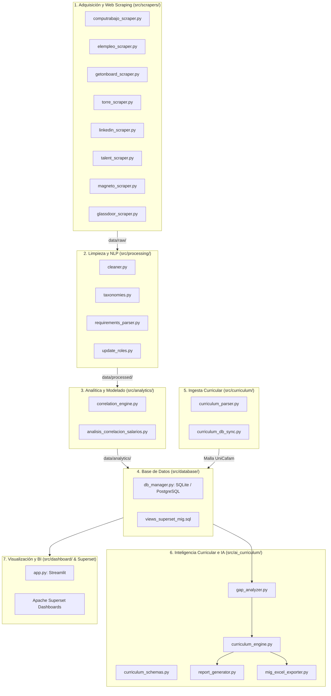

# 📖 Catálogo Detallado de Módulos y Comandos de Ejecución
## Sistema de Inteligencia Laboral, Minería NLP y Diseño Curricular con IA (UniCafam)

Este documento detalla exhaustivamente cada uno de los módulos desarrollados en el proyecto, su arquitectura técnica, entradas/salidas, dependencias y los comandos específicos para su ejecución individual o en pipeline.

---

## 🗺️ Mapa de Arquitectura del Sistema



---

## 1. Módulos de Adquisición y Web Scraping (`src/scrapers/`)

Ubicación: `src/scrapers/`  
**Propósito:** Extracción automatizada, multiportal y tolerante a fallos de ofertas laborales para perfiles tecnológicos (Científicos de Datos, Analistas, Ingenieros de Datos, etc.).

### Módulos Implementados:
* **`base_scraper.py`**: Clase abstracta base (`BaseScraper`) que define contratos estándar (`scrape()`, headers HTTP con rotación de User-Agent, retardos anti-bloqueo y estructuras de datos unificadas).
* **`computrabajo_scraper.py`**: Extractor especializado en *CompuTrabajo Colombia*. Parsea títulos, salarios en COP, departamentos/ciudades, modalidades de trabajo y descripciones completas.
* **`elempleo_scraper.py`**: Extractor para el portal *ElEmpleo.com*, gestionando paginación dinámica y rangos salariales en millones de COP.
* **`getonboard_scraper.py`**: Extractor para *Get on Board LATAM* enfocado en ofertas tech remotas/híbridas con tecnologías clave y salarios en USD/COP.
* **`torre_scraper.py`**: Conector para ofertas indexadas de la plataforma *Torre.ai*.
* **`linkedin_scraper.py`**: Extractor ligero para ofertas públicas de *LinkedIn Jobs* sin requerir sesión autenticada.
* **`talent_scraper.py`**: Extractor para el agregador de empleo *Talent.com*.
* **`magneto_scraper.py` & `glassdoor_scraper.py`**: Scrapers auxiliares para portales corporativos y salarios de referencia.

### 💻 Comandos de Ejecución:

```bash
# 1. Extracción vía Orquestador CLI (Recomendado)
python main.py --scrape --role "cientifico-de-datos" --pages 5

# 2. Extracción para otro rol específico (ej. Analista de Datos)
python main.py --scrape --role "analista-de-datos" --pages 10

# 3. Ejecución directa/test de un scraper individual (ej. CompuTrabajo)
python -c "from src.scrapers.computrabajo_scraper import CompuTrabajoScraper; s = CompuTrabajoScraper(); print(len(s.scrape('cientifico-de-datos', max_pages=2)))"
```

**Salidas generadas:**
* `data/raw/ofertas_consolidadas.xlsx`
* `data/raw/ofertas_computrabajo.xlsx`
* Tabla `ofertas_raw` en la base de datos `data/labor_market.db`.

---

## 2. Módulos de Limpieza, Taxonomías y NLP (`src/processing/`)

Ubicación: `src/processing/`  
**Propósito:** Normalización de datos crudos, desanonimización, estandarización de salarios numéricos e inferencia de habilidades/tecnologías mediante Procesamiento de Lenguaje Natural (NLP) y expresiones regulares taxonómicas.

### Módulos Implementados:
* **`taxonomies.py`**: Diccionario canónico jerárquico de más de 60 competencias tecnológicas y blandas agrupadas en categorías: *Lenguajes (Python, R, SQL, Java)*, *Big Data (Spark, Databricks, Hadoop)*, *Cloud (AWS, GCP, Azure)*, *Bases de Datos (PostgreSQL, MongoDB, NoSQL)*, *Visualización (Power BI, Tableau)*, *ML/Deep Learning (Scikit-Learn, PyTorch, TensorFlow)*, *Gobierno de Datos* y *Habilidades Blandas*.
* **`cleaner.py`**: Funciones de sanitización de texto, conversión de texto salarial a valores numéricos en COP, extracción de años de experiencia requerida, detección de modalidades (Remoto / Híbrido / Presencial) y sanitización de caracteres inválidos para hojas de cálculo.
* **`requirements_parser.py`**: Pipeline integral de minería de texto (`procesar_pipeline_nlp()`). Genera columnas binarias (one-hot encoding) para cada habilidad técnica y construye la matriz estructurada de ofertas.
* **`update_roles.py`**: Script de reclasificación contextual de roles en base de datos (`actualizar_roles_reales.sql`) diferenciando Data Scientists, Data Analysts, Data Engineers y Machine Learning Engineers.

### 💻 Comandos de Ejecución:

```bash
# 1. Ejecución del pipeline NLP vía Orquestador
python main.py --process

# 2. Ejecución directa del parser de requisitos
python src/processing/requirements_parser.py

# 3. Reclasificación de roles en base de datos
python src/processing/update_roles.py
```

**Salidas generadas:**
* `data/processed/ofertas_analizadas.xlsx`
* Tabla `ofertas_procesadas` en la base de datos `data/labor_market.db`.

---

## 3. Módulos de Análisis Estadístico y Econometría (`src/analytics/`)

Ubicación: `src/analytics/` y raíz del proyecto  
**Propósito:** Modelado cuantitativo de valorización económica, cálculo de primas salariales porcentuales por tecnología y análisis de correlación lineal/logarítmica.

### Módulos Implementados:
* **`correlation_engine.py`**: Motor estadístico que calcula:
  * Matriz de correlación de Pearson y Spearman entre variables continuas y habilidades binarias.
  * Análisis de prima salarial promedio: $\Delta\% = \frac{\bar{S}_{\text{con skill}} - \bar{S}_{\text{sin skill}}}{\bar{S}_{\text{sin skill}}} \times 100$.
  * Generación del dataset multidimensional en formato ancho y largo para herramientas de Business Intelligence.
* **`analisis_correlacion_salarios.py`**: Script de investigación que genera gráficos de dispersión de alta calidad (`salario_vs_experiencia.png`) y reportes estadísticos en consola.

### 💻 Comandos de Ejecución:

```bash
# 1. Análisis y generación de matrices vía Orquestador
python main.py --analyze

# 2. Ejecutar script standalone de correlaciones y generación de gráficos
python analisis_correlacion_salarios.py
```

**Salidas generadas:**
* `data/analytics/dataset_dashboard_salarios.xlsx` (Libro con 4 hojas: Modelado, Matriz Correlaciones, Valor Habilidades, Top Combinaciones).
* `data/analytics/matriz_ofertas_dashboard.csv` y `matriz_ofertas_dashboard.csv`.
* `data/analytics/habilidades_largo_dashboard.csv` y `habilidades_largo_dashboard.csv`.
* `salario_vs_experiencia.png` (Gráfico de regresión lineal salario vs. años de experiencia).
* Tablas `valor_economico_habilidades` y `matriz_correlaciones` en SQLite.

---

## 4. Módulos de Persistencia y Base de Datos Dimensional (`src/database/`)

Ubicación: `src/database/` y `data/`  
**Propósito:** Gestión unificada de base de datos relacional y dimensional (SQLite local y PostgreSQL remoto en servidor Hetzner), snapshots históricos y vistas analíticas para Apache Superset.

### Módulos Implementados:
* **`db_manager.py`**: Clase `DatabaseManager` con métodos para:
  * `guardar_dataframe()`, `leer_tabla()`, `ejecutar_script_sql()`.
  * `registrar_snapshot_historico()`: Implementación de modelo dimensional con tablas de hechos (`fact_ofertas_laborales`, `fact_habilidades_demandadas`), dimensiones (`dim_tiempo`, `dim_portal`, `dim_modalidad`) y snapshots versionados.
* **`views_superset_mig.sql`**: Script DDL/DML con vistas optimizadas para Apache Superset y matrices de brecha curricular (`vista_brecha_mercado_vs_curriculo`, `vista_kpis_resumen_mig`, `vista_propuestas_nuevos_programas`).

### 💻 Comandos de Ejecución:

```bash
# 1. Ver tablas y registros actuales en la base de datos local
python -c "from src.database.db_manager import DatabaseManager; db = DatabaseManager(); print(db.listar_tablas())"

# 2. Aplicar vistas SQL avanzadas a la base de datos
python -c "from src.database.db_manager import DatabaseManager; db = DatabaseManager(); db.ejecutar_script_sql('src/database/views_superset_mig.sql')"
```

---

## 5. Módulos de Ingesta y Análisis Curricular (`src/curriculum/`)

Ubicación: `src/curriculum/`  
**Propósito:** Ingesta automatizada de la estructura académica oficial de UniCafam (formatos Excel de microcurrículos), extracción de competencias, saberes específicos y mapeo contra habilidades del mercado laboral.

### Módulos Implementados:
* **`curriculum_parser.py`**: Parsea recursivamente los microcurrículos oficiales de la carpeta `data/curriculo_unicafam/`, extrayendo créditos, horas TFD/TTI, competencias generales, justificaciones y saberes temáticos clase a clase.
* **`curriculum_db_sync.py`**: Sincroniza la malla curricular en la base de datos SQLite local (`data/curriculo_unicafam/curriculo_unicafam.db`) y genera el archivo DDL/DML de migración a PostgreSQL (`cargar_malla_hetzner.sql`).

### 💻 Comandos de Ejecución:

```bash
# 1. Ejecutar parsing de microcurrículos y mostrar resumen de créditos/materias
python src/curriculum/curriculum_parser.py

# 2. Sincronizar malla curricular y generar script SQL para Hetzner
python src/curriculum/curriculum_db_sync.py
```

**Salidas generadas:**
* `data/curriculo_unicafam/curriculo_unicafam.db`
* `data/curriculo_unicafam/cargar_malla_hetzner.sql`

---

## 6. Motor de Inteligencia Curricular con IA y Exportador MIG (`src/ai_curriculum/`)

Ubicación: `src/ai_curriculum/`  
**Propósito:** Motor de Inteligencia Artificial que cruza las demandas del mercado laboral contra el currículo vigente de UniCafam, calcula brechas de pertinencia y genera propuestas académicas completas bajo el **Decreto 1330 (MEN)** exportadas a la **Matriz MIG oficial**.

### Módulos Implementados:
* **`curriculum_schemas.py`**: Modelos Pydantic v2 que garantizan la estructura tipada estricta de las propuestas académicas (Propuestas, Asignaturas, Semestres, Núcleos Problémicos, Perfiles Ocupacionales, Justificación MEN y Presupuesto).
* **`gap_analyzer.py`**: Cuantifica brechas de cobertura entre el mercado y la universidad (Habilidades huérfanas en el mercado, habilidades con sobre-oferta, índice de obsolescencia tecnológica).
* **`curriculum_engine.py`**: Motor orquestador con modelos LLM (Gemini 2.5 / Gemma) para generación de nuevas mallas curriculares (Tecnología, Profesionalización y Educación Continuada).
* **`report_generator.py`**: Generador de informes ejecutivos en Markdown de alta densidad y rigor académico.
* **`mig_excel_exporter.py`**: Exportador automatizado que escribe libros de Excel con el formato idéntico de la **Matriz MIG Institucional de UniCafam** con fórmulas de ponderación y hojas individuales por programa.

### 💻 Comandos de Ejecución:

```bash
# 1. Ejecutar diagnóstico de brechas y generación curricular con IA
python main.py --curriculum-ia

# 2. Exportar propuestas a los libros Excel oficiales Formato MATRIZ MIG
python main.py --export-mig

# 3. Ejecución directa del analizador de brechas
python src/ai_curriculum/gap_analyzer.py

# 4. Ejecución directa del exportador Excel MIG
python src/ai_curriculum/mig_excel_exporter.py
```

**Salidas generadas:**
* `data/curriculo_unicafam/recomendaciones_ia_curriculo.json` (Diagnóstico y mallas completas en JSON estructurado).
* `docs/informe_recomendaciones_unicafam_ia.md` (Informe ejecutivo académico).
* `data/curriculo_unicafam/mig_propuestas/MATRIZ_MIG_MASTER_PROPUESTAS_UNICAFAM.xlsx` (Libro maestro consolidado).
* `data/curriculo_unicafam/mig_propuestas/MATRIZ_MIG_*.xlsx` (Libros individuales por programa propuesto).
* `data/curriculo_unicafam/cargar_propuestas_hetzner.sql` (Script de persistencia en PostgreSQL).

---

## 7. Módulo de Visualización e Interfaz Web (`src/dashboard/`)

Ubicación: `src/dashboard/app.py`  
**Propósito:** Dashboard interactivo para toma de decisiones directivas, exploración de vacantes, simulación de primas salariales y benchmarking curricular.

### Módulo Implementado:
* **`app.py`**: Aplicación web construida con **Streamlit** y **Plotly** que incluye:
  * Filtros dinámicos por rol, modalidad, departamento y rango de experiencia.
  * KPIs ejecutivos (Salario promedio, mediana, número de ofertas indexadas).
  * Matriz de calor interactiva de correlaciones tecnológicas.
  * Ranking de primas salariales y retorno económico por habilidad.
  * Simulador de salario estimado según stack tecnológico seleccionado.
  * Pestaña de pertinencia curricular y diagnóstico UniCafam.

### 💻 Comandos de Ejecución:

```bash
# 1. Lanzamiento vía Orquestador CLI
python main.py --dashboard

# 2. Lanzamiento directo con Streamlit
streamlit run src/dashboard/app.py

# 3. Lanzamiento especificando puerto o modo headless
streamlit run src/dashboard/app.py --server.port 8501 --server.headless true
```

---

## 8. Orquestador Central y Flujo Punta a Punta (`main.py`)

Ubicación: `main.py`  
**Propósito:** Punto de entrada único del sistema con interfaz CLI mediante `argparse`.

### 💻 Tabla de Argumentos de `main.py`:

| Parámetro | Tipo | Descripción | Ejemplo |
| :--- | :---: | :--- | :--- |
| `--all` | Flag | Ejecuta el flujo completo de punta a punta (Scraping -> NLP -> Analítica -> MIG -> Dashboard) | `python main.py --all` |
| `--scrape` | Flag | Ejecuta exclusivamente la extracción multi-portal | `python main.py --scrape` |
| `--process` | Flag | Ejecuta la limpieza y minería NLP de requisitos | `python main.py --process` |
| `--analyze` | Flag | Ejecuta el cálculo estadístico, correlaciones y primas | `python main.py --analyze` |
| `--curriculum-ia`| Flag | Ejecuta el motor LLM de diagnóstico y diseño curricular | `python main.py --curriculum-ia` |
| `--export-mig` | Flag | Exporta las propuestas curriculares a libros Excel MIG | `python main.py --export-mig` |
| `--dashboard` | Flag | Levanta la aplicación interactiva Streamlit | `python main.py --dashboard` |
| `--role` | String | Define el rol o término de búsqueda (Default: `cientifico-de-datos`) | `python main.py --scrape --role "data-engineer"` |
| `--pages` | Int | Límite de páginas a scrapear por portal (Default: `5`) | `python main.py --scrape --pages 10` |

---

## 9. Notebooks y Scripts de Soporte

| Archivo | Ubicación | Descripción | Comando de Uso |
| :--- | :--- | :--- | :--- |
| **`analisis_exploratorio_datos.ipynb`** | `notebooks/` | Cuaderno Jupyter con análisis exploratorio de datos (EDA), pruebas de normalidad y gráficos de distribución | `jupyter lab notebooks/analisis_exploratorio_datos.ipynb` |
| **`procesar_requisitos.py`** | Raíz | Script de conveniencia para re-procesar texto plano de requisitos | `python procesar_requisitos.py` |
| **`demo.py`** | Raíz | Script de demostración rápida con datos simulados/reducidos | `python demo.py` |
| **`cargar_malla_hetzner.sql`** | `data/curriculo_unicafam/` | DDL/DML para carga de malla académica en base PostgreSQL remota | `psql -h <host> -U <user> -d <db> -f data/curriculo_unicafam/cargar_malla_hetzner.sql` |
| **`cargar_propuestas_hetzner.sql`** | `data/curriculo_unicafam/` | DDL/DML para carga de propuestas académicas IA en PostgreSQL | `psql -h <host> -U <user> -d <db> -f data/curriculo_unicafam/cargar_propuestas_hetzner.sql` |

---

## 🚀 Resumen Rápido: Cheat Sheet de Comandos

```bash
# ====================================================================
# COMANDOS PRINCIPALES DEL PROYECTO (COPIAR Y PEGAR)
# ====================================================================

# 1. Extracción de datos del mercado laboral
python main.py --scrape --role "cientifico-de-datos" --pages 5

# 2. Minería NLP y extracción de habilidades
python main.py --process

# 3. Modelado estadístico y cálculo de primas salariales
python main.py --analyze

# 4. Ingesta y sincronización de malla curricular UniCafam
python src/curriculum/curriculum_db_sync.py

# 5. Generación de propuestas curriculares con IA (Gemini / Gemma)
python main.py --curriculum-ia

# 6. Exportación de matrices académicas oficiales formato MIG
python main.py --export-mig

# 7. Despliegue del Dashboard interactivo
python main.py --dashboard
# (o: streamlit run src/dashboard/app.py)

# 8. Pipeline Completo End-to-End
python main.py --all
```
