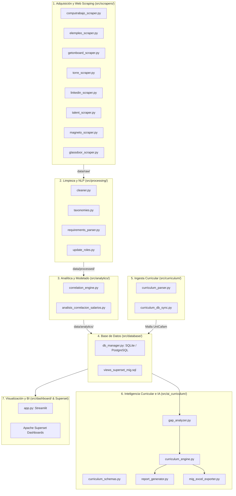

# 📖 Catálogo Detallado de Módulos y Comandos de Ejecución
## Sistema de Inteligencia Laboral, Minería NLP y Diseño Curricular con IA (UniCafam)

Este documento detalla exhaustivamente cada uno de los módulos desarrollados en el proyecto, su arquitectura técnica, entradas/salidas, dependencias y los comandos específicos para su ejecución individual o en pipeline.

---

## 🗺️ Mapa de Arquitectura del Sistema



---

## 1. Módulos de Adquisición y Web Scraping (`src/scrapers/`)

Ubicación: `src/scrapers/`  
**Propósito:** Extracción automatizada, multiportal y tolerante a fallos de ofertas laborales para perfiles tecnológicos (Científicos de Datos, Analistas, Ingenieros de Datos, etc.).

### Módulos Implementados:
* **`base_scraper.py`**: Clase abstracta base (`BaseScraper`) que define contratos estándar (`scrape()`, headers HTTP con rotación de User-Agent, retardos anti-bloqueo y estructuras de datos unificadas).
* **`computrabajo_scraper.py`**: Extractor especializado en *CompuTrabajo Colombia*. Parsea títulos, salarios en COP, departamentos/ciudades, modalidades de trabajo y descripciones completas.
* **`elempleo_scraper.py`**: Extractor para el portal *ElEmpleo.com*, gestionando paginación dinámica y rangos salariales en millones de COP.
* **`getonboard_scraper.py`**: Extractor para *Get on Board LATAM* enfocado en ofertas tech remotas/híbridas con tecnologías clave y salarios en USD/COP.
* **`torre_scraper.py`**: Conector para ofertas indexadas de la plataforma *Torre.ai*.
* **`linkedin_scraper.py`**: Extractor ligero para ofertas públicas de *LinkedIn Jobs* sin requerir sesión autenticada.
* **`talent_scraper.py`**: Extractor para el agregador de empleo *Talent.com*.
* **`magneto_scraper.py` & `glassdoor_scraper.py`**: Scrapers auxiliares para portales corporativos y salarios de referencia.

### 💻 Comandos de Ejecución:

```bash
# 1. Extracción vía Orquestador CLI (Recomendado)
python main.py --scrape --role "cientifico-de-datos" --pages 5

# 2. Extracción para otro rol específico (ej. Analista de Datos)
python main.py --scrape --role "analista-de-datos" --pages 10

# 3. Ejecución directa/test de un scraper individual (ej. CompuTrabajo)
python -c "from src.scrapers.computrabajo_scraper import CompuTrabajoScraper; s = CompuTrabajoScraper(); print(len(s.scrape('cientifico-de-datos', max_pages=2)))"
```

**Salidas generadas:**
* `data/raw/ofertas_consolidadas.xlsx`
* `data/raw/ofertas_computrabajo.xlsx`
* Tabla `ofertas_raw` en la base de datos `data/labor_market.db`.

---

## 2. Módulos de Limpieza, Taxonomías y NLP (`src/processing/`)

Ubicación: `src/processing/`  
**Propósito:** Normalización de datos crudos, desanonimización, estandarización de salarios numéricos e inferencia de habilidades/tecnologías mediante Procesamiento de Lenguaje Natural (NLP) y expresiones regulares taxonómicas.

### Módulos Implementados:
* **`taxonomies.py`**: Diccionario canónico jerárquico de más de 60 competencias tecnológicas y blandas agrupadas en categorías: *Lenguajes (Python, R, SQL, Java)*, *Big Data (Spark, Databricks, Hadoop)*, *Cloud (AWS, GCP, Azure)*, *Bases de Datos (PostgreSQL, MongoDB, NoSQL)*, *Visualización (Power BI, Tableau)*, *ML/Deep Learning (Scikit-Learn, PyTorch, TensorFlow)*, *Gobierno de Datos* y *Habilidades Blandas*.
* **`cleaner.py`**: Funciones de sanitización de texto, conversión de texto salarial a valores numéricos en COP, extracción de años de experiencia requerida, detección de modalidades (Remoto / Híbrido / Presencial) y sanitización de caracteres inválidos para hojas de cálculo.
* **`requirements_parser.py`**: Pipeline integral de minería de texto (`procesar_pipeline_nlp()`). Genera columnas binarias (one-hot encoding) para cada habilidad técnica y construye la matriz estructurada de ofertas.
* **`update_roles.py`**: Script de reclasificación contextual de roles en base de datos (`actualizar_roles_reales.sql`) diferenciando Data Scientists, Data Analysts, Data Engineers y Machine Learning Engineers.

### 💻 Comandos de Ejecución:

```bash
# 1. Ejecución del pipeline NLP vía Orquestador
python main.py --process

# 2. Ejecución directa del parser de requisitos
python src/processing/requirements_parser.py

# 3. Reclasificación de roles en base de datos
python src/processing/update_roles.py
```

**Salidas generadas:**
* `data/processed/ofertas_analizadas.xlsx`
* Tabla `ofertas_procesadas` en la base de datos `data/labor_market.db`.

---

## 3. Módulos de Análisis Estadístico y Econometría (`src/analytics/`)

Ubicación: `src/analytics/` y raíz del proyecto  
**Propósito:** Modelado cuantitativo de valorización económica, cálculo de primas salariales porcentuales por tecnología y análisis de correlación lineal/logarítmica.

### Módulos Implementados:
* **`correlation_engine.py`**: Motor estadístico que calcula:
  * Matriz de correlación de Pearson y Spearman entre variables continuas y habilidades binarias.
  * Análisis de prima salarial promedio: $\Delta\% = \frac{\bar{S}_{\text{con skill}} - \bar{S}_{\text{sin skill}}}{\bar{S}_{\text{sin skill}}} \times 100$.
  * Generación del dataset multidimensional en formato ancho y largo para herramientas de Business Intelligence.
* **`analisis_correlacion_salarios.py`**: Script de investigación que genera gráficos de dispersión de alta calidad (`salario_vs_experiencia.png`) y reportes estadísticos en consola.

### 💻 Comandos de Ejecución:

```bash
# 1. Análisis y generación de matrices vía Orquestador
python main.py --analyze

# 2. Ejecutar script standalone de correlaciones y generación de gráficos
python analisis_correlacion_salarios.py
```

**Salidas generadas:**
* `data/analytics/dataset_dashboard_salarios.xlsx` (Libro con 4 hojas: Modelado, Matriz Correlaciones, Valor Habilidades, Top Combinaciones).
* `data/analytics/matriz_ofertas_dashboard.csv` y `matriz_ofertas_dashboard.csv`.
* `data/analytics/habilidades_largo_dashboard.csv` y `habilidades_largo_dashboard.csv`.
* `salario_vs_experiencia.png` (Gráfico de regresión lineal salario vs. años de experiencia).
* Tablas `valor_economico_habilidades` y `matriz_correlaciones` en SQLite.

---

## 4. Módulos de Persistencia y Base de Datos Dimensional (`src/database/`)

Ubicación: `src/database/` y `data/`  
**Propósito:** Gestión unificada de base de datos relacional y dimensional (SQLite local y PostgreSQL remoto en servidor Hetzner), snapshots históricos y vistas analíticas para Apache Superset.

### Módulos Implementados:
* **`db_manager.py`**: Clase `DatabaseManager` con métodos para:
  * `guardar_dataframe()`, `leer_tabla()`, `ejecutar_script_sql()`.
  * `registrar_snapshot_historico()`: Implementación de modelo dimensional con tablas de hechos (`fact_ofertas_laborales`, `fact_habilidades_demandadas`), dimensiones (`dim_tiempo`, `dim_portal`, `dim_modalidad`) y snapshots versionados.
* **`views_superset_mig.sql`**: Script DDL/DML con vistas optimizadas para Apache Superset y matrices de brecha curricular (`vista_brecha_mercado_vs_curriculo`, `vista_kpis_resumen_mig`, `vista_propuestas_nuevos_programas`).

### 💻 Comandos de Ejecución:

```bash
# 1. Ver tablas y registros actuales en la base de datos local
python -c "from src.database.db_manager import DatabaseManager; db = DatabaseManager(); print(db.listar_tablas())"

# 2. Aplicar vistas SQL avanzadas a la base de datos
python -c "from src.database.db_manager import DatabaseManager; db = DatabaseManager(); db.ejecutar_script_sql('src/database/views_superset_mig.sql')"
```

---

## 5. Módulos de Ingesta y Análisis Curricular (`src/curriculum/`)

Ubicación: `src/curriculum/`  
**Propósito:** Ingesta automatizada de la estructura académica oficial de UniCafam (formatos Excel de microcurrículos), extracción de competencias, saberes específicos y mapeo contra habilidades del mercado laboral.

### Módulos Implementados:
* **`curriculum_parser.py`**: Parsea recursivamente los microcurrículos oficiales de la carpeta `data/curriculo_unicafam/`, extrayendo créditos, horas TFD (acompañamiento docente) y TTI (trabajo independiente), competencias generales, justificaciones y saberes temáticos clase a clase.
  * **Características recientes (Hito 27):** Excluye automáticamente la subcarpeta de salida `mig_propuestas/` para prevenir auto-contaminación (32 microcurrículos de pregrado limpios parseados), omite el boilerplate de Office 365 / licenciamiento Microsoft, e implementa una taxonomía técnica granular con regex para: *Power BI*, *Tableau*, *Visualización & Data Storytelling*, *Python*, *SQL*, *Bases de Datos NoSQL (MongoDB)*, *NLP / LLMs*, *Git / Control de Versiones*, *ETL / Pipelines* y *Machine Learning*.
* **`curriculum_db_sync.py`**: Sincroniza la malla curricular en la base de datos SQLite local (`data/curriculo_unicafam/curriculo_unicafam.db`) en las tablas `dim_malla_curricular` y `fact_habilidades_academicas`, y genera el script DDL/DML de migración a PostgreSQL (`cargar_malla_hetzner.sql`).

### 💻 Comandos de Ejecución:

```bash
# 1. Ejecutar parsing de microcurrículos y mostrar resumen de créditos/materias
python src/curriculum/curriculum_parser.py

# 2. Sincronizar malla curricular y generar script SQL para Hetzner / Supabase
python src/curriculum/curriculum_db_sync.py
```

**Salidas generadas:**
* `data/curriculo_unicafam/curriculo_unicafam.db`
* `data/curriculo_unicafam/cargar_malla_hetzner.sql`

---

## 6. Motor de Inteligencia Curricular con IA y Exportador MIG (`src/ai_curriculum/`)

Ubicación: `src/ai_curriculum/`  
**Propósito:** Motor de Inteligencia Artificial que cruza las demandas del mercado laboral contra el currículo vigente de UniCafam, calcula brechas de pertinencia y genera propuestas académicas completas bajo el **Decreto 1330 (MEN)** exportadas a la **Matriz MIG oficial**.

### Módulos Implementados:
* **`curriculum_schemas.py`**: Modelos Pydantic v2 que garantizan la estructura tipada estricta de las propuestas académicas (`ModuloAsignatura`, `PerfilDocente`, `InversionPrograma`, `DiagnosticoPrograma`, `PropuestaPrograma`, `PortafolioRecomendacionesIA`).
* **`gap_analyzer.py`**: Motor determinístico cuantitativo que cruza la oferta académica de UniCafam contra las 317 vacantes únicas analizadas:
  * **Penetración atómica exacta:** Conteo de menciones directas por habilidad sin sesgo de longitud de texto.
  * **Reconocimiento de Fortalezas:** Identifica *Power BI* (19.5% de demanda laboral, 2 materias en la malla), *SQL* (15.5%), *Python* (13.6%) y *Excel Avanzado* (11.0%) como fortalezas consolidadas.
  * **Contexto Institucional Ecosistema Dual:** Inyecta en el contexto de IA la articulación por ciclos propedéuticos entre la *Tecnología en Análisis y Gestión de Datos* (83 créditos, 5 semestres) y el pregrado *Profesional en Ciencia de Datos*, además de *Ingeniería de Sistemas*.
  * **Identificación de Brechas Críticas (GAPs):** Detecta carencias en *Cloud Computing* (AWS 12.9%, Azure 11.4%, GCP 6.9%), *Big Data* (Spark 7.6%), *MLOps / Docker* (Docker 6.3%), y *Modelos de Lenguaje / GenAI*.
* **`curriculum_engine.py`**: Motor generativo orquestador potenciado con **`models/gemini-3.5-flash`** (Google Gemini API). Cuenta con:
  * Prompt institucional blindado que prohíbe inventar debilidades en habilidades formalmente impartidas (ej. Power BI).
  * Manejo de rate-limits con retardo preventivo y backoff exponencial ante cuotas HTTP 429.
  * Generación de un portafolio de 4 propuestas de alta pertinencia:
    1. `PROP_01`: Electiva de Profundización - *Cloud Data Engineering & MLOps* (AWS, GCP, Docker, MLflow, FastAPI).
    2. `PROP_02`: Microcredencial - *IA Generativa y Arquitecturas RAG para Negocios* (LangChain, Pinecone, ChromaDB, Hugging Face).
    3. `PROP_03`: Especialización Universitaria - *Especialización en Ingeniería de Datos y Arquitecturas Cloud* (Databricks, Spark, Airflow, Docker, Kubernetes).
    4. `PROP_04`: Maestría Aplicada - *Maestría en Inteligencia Artificial y Ciencia de Datos Estratégica* (Deep Learning, inferencia causal, clústeres GPU).
* **`report_generator.py`**: Generador de informes ejecutivos en Markdown de alta densidad (`docs/informe_recomendaciones_unicafam_ia.md`) y sincronización de diagnósticos en tablas `fact_diagnostico_ia` y `dim_propuestas_academicas`.
* **`mig_excel_exporter.py`**: Generador automatizado openpyxl que escribe libros de Excel con el formato idéntico de la **Matriz Integrada de Gestión (MIG)** institucional de UniCafam con fórmulas dinámicas, formatos de celda institucionales, pestañas por módulo y libro maestro consolidado.

### 💻 Comandos de Ejecución:

```bash
# 1. Ejecutar diagnóstico de brechas y generación curricular con IA
python main.py --curriculum-ia

# 2. Exportar propuestas a los libros Excel oficiales Formato MATRIZ MIG
python main.py --export-mig

# 3. Ejecución directa del analizador de brechas
python src/ai_curriculum/gap_analyzer.py

# 4. Ejecución directa del exportador Excel MIG
python src/ai_curriculum/mig_excel_exporter.py
```

**Salidas generadas:**
* `data/curriculo_unicafam/recomendaciones_ia_curriculo.json` (Diagnóstico y mallas completas en JSON estructurado).
* `docs/informe_recomendaciones_unicafam_ia.md` (Informe ejecutivo académico).
* `data/curriculo_unicafam/mig_propuestas/MATRIZ_MIG_MASTER_PROPUESTAS_UNICAFAM.xlsx` (Libro maestro consolidado).
* `data/curriculo_unicafam/mig_propuestas/MATRIZ_MIG_*.xlsx` (Libros individuales por programa propuesto).
* `data/curriculo_unicafam/cargar_propuestas_hetzner.sql` (Script de persistencia en PostgreSQL).

---

## 7. Módulo de Visualización e Interfaz Web (`src/dashboard/` y `src/web/`)

### 7.1 Portal Web Institucional y Landing Page UniCafam (`src/web/`)
Ubicación: `src/web/app.py` y `src/web/templates/index.html`  
**Propósito:** Landing page universitaria oficial de 3 páginas con la identidad visual de UniCafam (azul marino `#002D62` y naranja `#FF7A00`), visualización de métricas con Superset embebido y descarga directa activa de la Matriz MIG.

* **Página 1: El Proyecto:** Planteamiento del problema, justificación MEN (Decreto 1330), metodología en 5 fases y arquitectura del Observatorio.
* **Página 2: Métricas del Mercado:** Tarjetas KPI clave (317 vacantes, $4.25M COP local, $25.6M COP remoto, 29.1% transparencia), iframe embebido de Apache Superset y análisis de primas salariales.
* **Página 3: Propuestas Curriculares:** Diagnóstico FODA institucional, catálogo de las 4 propuestas académicas con tarifas segmentadas y botones de descarga activa de los archivos Excel formato MIG.

#### 🌐 Endpoints REST Expuestos:
* `GET /`: Renderizado HTML Jinja2 de la Landing Page institucional con navegación SPA por pestañas.
* `GET /api/kpis`: JSON con métricas agregadas del mercado laboral (vacantes, medianas salariales, cobertura).
* `GET /api/propuestas`: JSON estructurado con el diagnóstico FODA institucional y las 4 propuestas curriculares.
* `GET /descargas/{filename}`: Descarga binaria segura de matrices MIG individuales (`safe_name` sanitizado).
* `GET /descargas/consolidado/master`: Descarga directa del libro consolidado maestro (`MATRIZ_MIG_MASTER_PROPUESTAS_UNICAFAM.xlsx`).

```bash
# Lanzar la Landing Page Institucional UniCafam localmente
python main.py --web --port 8000
```

### 7.2 Dashboard Analítico Exploratorio Streamlit (`src/dashboard/`)
Ubicación: `src/dashboard/app.py`  
**Propósito:** Herramienta interactiva para analistas y toma de decisiones directivas, con filtros dinámicos por rol, modalidad, departamento y rango de experiencia.

```bash
# Lanzar el dashboard Streamlit
python main.py --dashboard
```

---

## 8. Orquestador Central y Flujo Punta a Punta (`main.py`)

Ubicación: `main.py`  
**Propósito:** Punto de entrada único del sistema con interfaz CLI mediante `argparse`.

### 💻 Tabla de Argumentos de `main.py`:

| Parámetro | Tipo | Descripción | Ejemplo |
| :--- | :---: | :--- | :--- |
| `--all` | Flag | Ejecuta el flujo completo de punta a punta (Scraping -> NLP -> Analítica -> MIG -> Dashboard) | `python main.py --all` |
| `--scrape` | Flag | Ejecuta exclusivamente la extracción multi-portal | `python main.py --scrape` |
| `--process` | Flag | Ejecuta la limpieza y minería NLP de requisitos | `python main.py --process` |
| `--analyze` | Flag | Ejecuta el cálculo estadístico, correlaciones y primas | `python main.py --analyze` |
| `--curriculum-ia`| Flag | Ejecuta el motor LLM de diagnóstico y diseño curricular con Gemini 3.5 Flash | `python main.py --curriculum-ia` |
| `--export-mig` | Flag | Exporta las propuestas curriculares a libros Excel MIG oficiales | `python main.py --export-mig` |
| `--web` | Flag | Lanza la Landing Page oficial UniCafam (FastAPI) | `python main.py --web --port 8000` |
| `--dashboard` | Flag | Levanta la aplicación interactiva Streamlit | `python main.py --dashboard` |
| `--port` | Int | Puerto para el servidor web (Default: `8000`) | `python main.py --web --port 8080` |
| `--role` | String | Define el rol o término de búsqueda (Default: `cientifico-de-datos`) | `python main.py --scrape --role "data-engineer"` |
| `--pages` | Int | Límite de páginas a scrapear por portal (Default: `5`) | `python main.py --scrape --pages 10` |

---

## 9. Módulo de Infraestructura, Contenerización y Despliegue en Producción

Ubicación: `Dockerfile`, `docker-compose.yml`, raíz y servidor Hetzner Cloud  
**Propósito:** Despliegue contenerizado en servidor VPS cloud (Ubuntu 24.04 LTS, IP `2.29.41.159`), enrutamiento perimetral con Traefik, gestión SSL/TLS y sincronización sin tiempos de inactividad (*Zero-Downtime Live Updates*).

### Componentes de Infraestructura:
* **`Dockerfile`**: Construcción ligera basada en `python:3.12-slim`, instalando dependencias mínimas del sistema (`curl`), dependencias de Python desde `requirements.txt` y exponiendo el puerto `8000` con `uvicorn`.
* **`docker-compose.yml`**: Define el servicio `unicafam-portal` conectado a la red externa `superset-stack_web`:
  * **Bind Mounts:** Mapea `./data:/app/data` y `./docs:/app/docs` para que las actualizaciones en los archivos JSON de recomendaciones y los libros Excel MIG se reflejen instantáneamente en el portal sin reconstruir imágenes.
  * **Etiquetas Traefik:** Configuración de routing HTTPS automático con Let's Encrypt para el dominio institucional `jfbernalp.dev` y `www.jfbernalp.dev`.
  * **Políticas de Reinicio:** `restart: unless-stopped` para alta disponibilidad.

### 💻 Comandos de Despliegue y Mantenimiento:

```bash
# 1. Construir la imagen local o remotamente
docker compose build unicafam-portal

# 2. Levantar el servicio en segundo plano
docker compose up -d unicafam-portal

# 3. Monitorear logs del contenedor en tiempo real
docker compose logs -f unicafam-portal

# 4. Verificar estado y puertos de los contenedores
docker compose ps

# 5. Reiniciar el servicio tras cambios en dependencias
docker compose restart unicafam-portal

# 6. Sincronizar cambios en el VPS remoto de Hetzner
ssh juan@2.29.41.159 "cd /home/juan/proyecto_investigativo && git pull && docker compose restart unicafam-portal"
```

---

## 10. Notebooks y Scripts de Soporte

| Archivo | Ubicación | Descripción | Comando de Uso |
| :--- | :--- | :--- | :--- |
| **`analisis_exploratorio_datos.ipynb`** | `notebooks/` | Cuaderno Jupyter con análisis exploratorio de datos (EDA), pruebas de normalidad y gráficos de distribución | `jupyter lab notebooks/analisis_exploratorio_datos.ipynb` |
| **`procesar_requisitos.py`** | Raíz | Script de conveniencia para re-procesar texto plano de requisitos | `python procesar_requisitos.py` |
| **`demo.py`** | Raíz | Script de demostración rápida con datos simulados/reducidos | `python demo.py` |
| **`cargar_malla_hetzner.sql`** | `data/curriculo_unicafam/` | DDL/DML para carga de malla académica en base PostgreSQL remota | `psql -h <host> -U <user> -d <db> -f data/curriculo_unicafam/cargar_malla_hetzner.sql` |
| **`cargar_propuestas_hetzner.sql`** | `data/curriculo_unicafam/` | DDL/DML para carga de propuestas académicas IA en PostgreSQL | `psql -h <host> -U <user> -d <db> -f data/curriculo_unicafam/cargar_propuestas_hetzner.sql` |

---

## 11. 🚀 Resumen Rápido: Cheat Sheet de Comandos

```bash
# ====================================================================
# COMANDOS PRINCIPALES DEL PROYECTO (COPIAR Y PEGAR)
# ====================================================================

# 1. Extracción de datos del mercado laboral
python main.py --scrape --role "cientifico-de-datos" --pages 5

# 2. Minería NLP y extracción de habilidades
python main.py --process

# 3. Modelado estadístico y cálculo de primas salariales
python main.py --analyze

# 4. Ingesta y sincronización de malla curricular UniCafam
python src/curriculum/curriculum_db_sync.py

# 5. Generación de propuestas curriculares con IA (Gemini 3.5 Flash)
python main.py --curriculum-ia

# 6. Exportación de matrices académicas oficiales formato MIG
python main.py --export-mig

# 7. Lanzamiento de la Landing Page Oficial UniCafam (FastAPI)
python main.py --web --port 8000

# 8. Despliegue del Dashboard interactivo exploratorio (Streamlit)
python main.py --dashboard
# (o: streamlit run src/dashboard/app.py)

# 9. Pipeline Completo End-to-End
python main.py --all

# 10. Despliegue en Producción con Docker Compose
docker compose up -d --build
```
